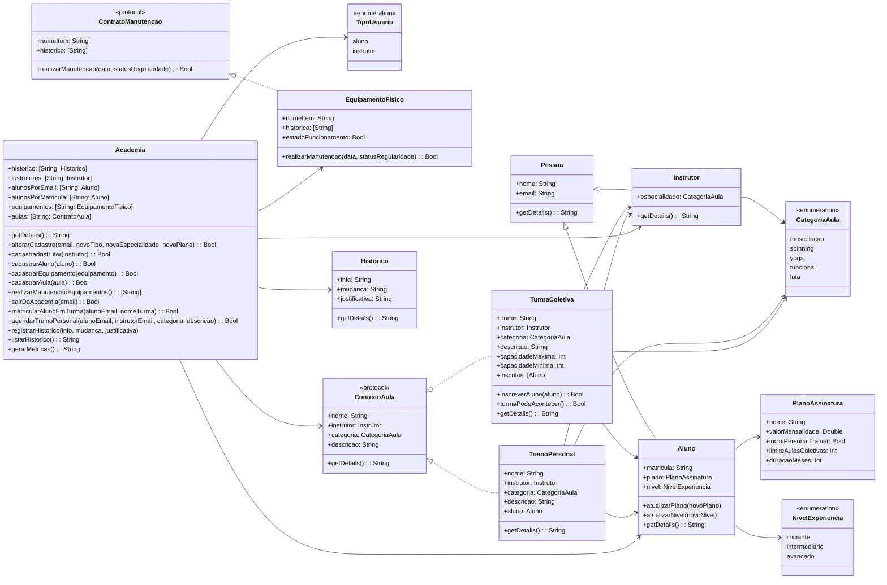

# Diagrama de Classes do Projeto

* Usando direction LR foi o jeito que achei que ficou mais organizado

```mermaid
    classDiagram
    direction LR
        class NivelExperiencia {
            <<enumeration>>
            iniciante
            intermediario
            avancado
        }

        class CategoriaAula {
            <<enumeration>>
            musculacao
            spinning
            yoga
            funcional
            luta
        }

        class TipoUsuario {
            <<enumeration>>
            aluno
            instrutor
        }

        class Pessoa {
            +nome: String
            +email: String
            +getDetails(): String
        }

        class Aluno {
            +matricula: String
            +plano: PlanoAssinatura
            +nivel: NivelExperiencia
            +atualizarPlano(novoPlano)
            +atualizarNivel(novoNivel)
            +getDetails(): String
        }

        class Instrutor {
            +especialidade: CategoriaAula
            +getDetails(): String
        }

        Pessoa <|-- Aluno
        Pessoa <|-- Instrutor

        class PlanoAssinatura {
            +nome: String
            +valorMensalidade: Double
            +incluiPersonalTrainer: Bool
            +limiteAulasColetivas: Int
            +duracaoMeses: Int
        }

        Aluno --> PlanoAssinatura

        class ContratoManutencao {
            <<protocol>>
            +nomeItem: String
            +historico: [String]
            +realizarManutencao(data, statusRegularidade): Bool
        }

        class EquipamentoFisico {
            +nomeItem: String
            +historico: [String]
            +estadoFuncionamento: Bool
            +realizarManutencao(data, statusRegularidade): Bool
        }

        ContratoManutencao <|.. EquipamentoFisico

        class ContratoAula {
            <<protocol>>
            +nome: String
            +instrutor: Instrutor
            +categoria: CategoriaAula
            +descricao: String
            +getDetails(): String
        }

        class TurmaColetiva {
            +nome: String
            +instrutor: Instrutor
            +categoria: CategoriaAula
            +descricao: String
            +capacidadeMaxima: Int
            +capacidadeMinima: Int
            +inscritos: [Aluno]
            +inscreverAluno(aluno): Bool
            +turmaPodeAcontecer(): Bool
            +getDetails(): String
        }

        class TreinoPersonal {
            +nome: String
            +instrutor: Instrutor
            +categoria: CategoriaAula
            +descricao: String
            +aluno: Aluno
            +getDetails(): String
        }

        ContratoAula <|.. TurmaColetiva
        ContratoAula <|.. TreinoPersonal

        TurmaColetiva --> Instrutor
        TurmaColetiva --> Aluno
        TreinoPersonal --> Instrutor
        TreinoPersonal --> Aluno

        class Historico {
            +info: String
            +mudanca: String
            +justificativa: String
            +getDetails(): String
        }

        class Academia {
            +historico: [String: Historico]
            +instrutores: [String: Instrutor]
            +alunosPorEmail: [String: Aluno]
            +alunosPorMatricula: [String: Aluno]
            +equipamentos: [String: EquipamentoFisico]
            +aulas: [String: ContratoAula]

            +getDetails(): String
            +alterarCadastro(email, novoTipo, novaEspecialidade, novoPlano): Bool
            +cadastrarInstrutor(instrutor): Bool
            +cadastrarAluno(aluno): Bool
            +cadastrarEquipamento(equipamento): Bool
            +cadastrarAula(aula): Bool
            +realizarManutencaoEquipamentos(): [String]
            +sairDaAcademia(email): Bool
            +matricularAlunoEmTurma(alunoEmail, nomeTurma): Bool
            +agendarTreinoPersonal(alunoEmail, instrutorEmail, categoria, descricao): Bool
            +registrarHistorico(info, mudanca, justificativa)
            +listarHistorico(): String
            +gerarMetricas(): String
        }

        Academia --> Instrutor
        Academia --> Aluno
        Academia --> EquipamentoFisico
        Academia --> ContratoAula
        Academia --> Historico

        Instrutor --> CategoriaAula
        Aluno --> NivelExperiencia
        TreinoPersonal --> CategoriaAula
        TurmaColetiva --> CategoriaAula
        Academia --> TipoUsuario
```